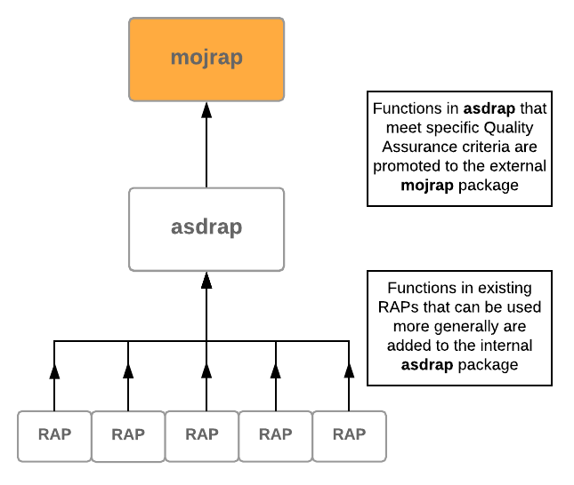

# mojrap

## Contents
* [What is this repo for?](#what-is-this-repo-for)
* [Where does this package sit in our infrastructure?](#where-does-this-package-sit-in-our-infrastructure)
* [Using the package](#using-the-package)
* [Functions in the package](#functions-in-the-package)
* [Package infrastructure](#package-infrastructure)
* [Contributing to the package](#contributing-to-the-package)
* [Other RAP Resources](#other-resources)

## What is this repo for?

This is a collection of quality assured, generalised functions that have been created in the various Reproducible Analytical Pipelines (e.g. Statistics Publications, Financial Reports etc.) within the Ministry of Justice. 

If you are implementing RAP within your own department, or just think some of these functions could be of use, please install the package and use away! Also, if you are using any of the functions and find a bug or can think of away to improve them, we would love your input - see [Contributing to the package](#contributing-to-the-package) for ways you can help.

## Where does this package sit in our infrastructure?

When someone creates a specific RAP within the MoJ, they look at their functions to see what can be made more general. Once these have been picked out, they are added to the internal Analytical Services Directorate RAP package [(asdrap)](https://github.com/moj-analytical-services/asdrap) where they get peer reviewed by other analysts and start getting unit-tested etc. Once the functions have been through sufficient QA (and been used in the 'real world' e.g. an official stats release) they are then promoted to here. 

TL;DR

## Using the package

If you just want to make use of the package, do the following:

* Run `devtools::install_github("moj-analytical-services/mojrap")` to download the package
* Load the package using `library(mojrap)`

You will now have access to all the functions in the library, using the following syntax:

Example: to use FUNCTION from the asdrap package, type `mojrap::FUNCTION()`

## Functions in the package

* `as_number.R` - Turns numerical strings into number format
* `connector.R` - Produces a connecting word for a compound sentence
* `date_type.R` - Takes standard dates and outputs them in specified formats
* `format_num.R` - Formats numerical values as thousand delimitted absolute values. Values of less than 10 are words
* `format_perc.R` - Formats fractions as percentages, with percentage signs
* `getThursday.R` - Predicts the next publication date for quarterly publications
* `incdec.R` - Quantifies changes in values eg. "increased by ..."
* `quarter_dates.R` - Caculates quarter dates

## Package Infrastructure
A whistle stop tour of the package for those who aren't as familiar with R/package development 

### R/
This is where most of the code which does the analysis lives. All the code is functions, only some of which are avaiable when you install the package.

### man/
This is where the package documentation that can usually be found running ?function_name 

### tests/
The code here simply tests the functions in the package are working as expected. None of this code does any of the analysis the package was designed for, instead acting as quality assurance for the functions that have been created to do the analysis.

### README.md
Contains the text for this document in Markdown format. This is the sole documentation for the package, other than occasional comments in the source code. The source code should be transparent enough that it is best to read the source code to understand how functions in the package work.

### NAMESPACE
Is a config file that should not be updated manually - instead use roxygen comments in the code. http://r-pkgs.had.co.nz/namespace.html

### DESCRIPTION
Is a config file. Most fields are self explanatory. http://r-pkgs.had.co.nz/description.html

## Contributing to the package

Now that you have created a reusable function, how do you share it with everyone?

1) Clone this repo:
In the terminal, run `git clone git@github.com:moj-analytical-services/mojrap.git`
Or see step 4.1.2 of the [platform guidance](https://moj-analytical-services.github.io/platform_user_guidance/using-github-with-r-studio.html#step-2-navigate-to-your-platform-r-studio-and-make-a-copy-of-the-github-project-in-your-r-studio) if you are having any difficulties.

2) Create a new branch and add your function(s) to it - see the [platform guidance](https://moj-analytical-services.github.io/platform_user_guidance/using-github-with-r-studio.html#working-on-a-branch.) if you aren't familiar with doing this

3) Open a [Pull Request](https://help.github.com/articles/creating-a-pull-request/) to merge your functions into the package. 

4) Get someone to [review](https://help.github.com/articles/about-pull-request-reviews/) your pull request. The reviewer must check that the function satisfies the following:
* Must have been used in a publication
* Must have unit testing
* Must pass unit testing of entire package
* Must have documentation around functions with examples

5) Merge your pull request. Once you have done this make sure to post in the RAP slack channel that you have merged in your changes so people can update their version of the package

Congratulations! You have now contibuted to the asdrap package! If you [reinstall the package](#using-the-package) you will be able to use your functions.

## Found a bug?

You can also contribute by helping to improve the existing functions. If you find a bug, or think there is a better way of doing something, raise an [issue](https://github.com/moj-analytical-services/mojrap/issues) and/or open a [pull request](https://github.com/moj-analytical-services/mojrap/pulls) with your suggested solution.

## Other resources

For bespoke code please see other MoJ repos:
* [OMSQ_RAP](https://github.com/moj-analytical-services/OMSQ_RAP) - our first publication that has been entirely RAPed
* [JDL_RAP](https://github.com/moj-analytical-services/JDL_RAP)
* [CCSQ_RAP](https://github.com/moj-analytical-services/CCSQ_RAP)

(Note that some of these may be accessible to users within the MoJ, but if you would like access to these let us know!)
Or from across government:
* DDCMS [Economics Estimates RAP](https://github.com/DCMSstats/eesectors)

If you are working within government and are looking to get up to speed with RAP, we would recommend joining the #rap_collaboration channel of the [Government Data Science Slack](https://govdatascience.slack.com/?redir=%2Fhome) and getting involved with the community there. Or there is the [RAP Companion](https://ukgovdatascience.github.io/rap_companion/) written by the Government Digital Service (GDS).
